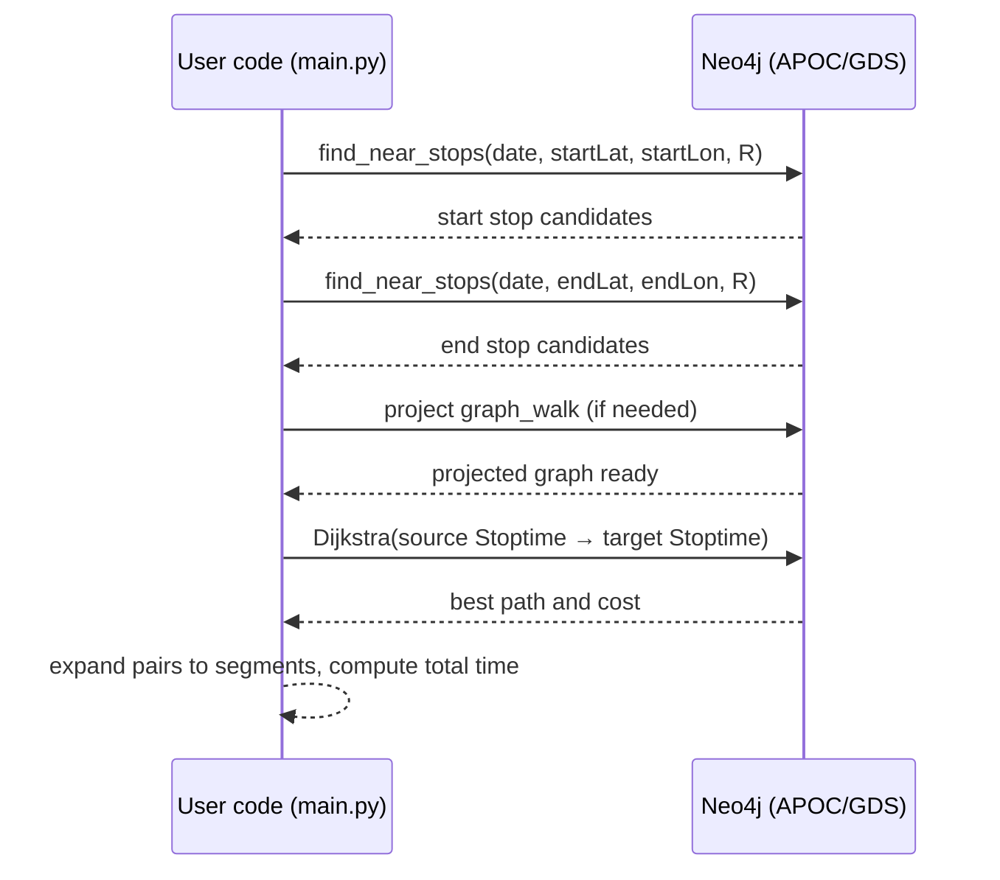

## Routing Algorithm for Graph DBs (Public Transport + Walking)

A routing pipeline that navigates a public transport graph augmented with pedestrian transfers. The project targets the city of Modena (IT) and combines GTFS transit data with walking links, leveraging Neo4j, APOC, and the Graph Data Science (GDS) library for shortest path computation.

### Key features
- Multi-modal routing: bus routes plus walking transfers between nearby stops
- Time-dependent edges: waits and in-vehicle travel times are captured via `Stoptime` ordering
- Graph Data Science: Dijkstra shortest path on a projected graph with a custom `waiting_time` weight
- Proximity search: find stops near arbitrary geo-coordinates using Neo4j spatial functions
- Example notebook and performance exploration

---

## Table of Contents
- [Project structure](#project-structure)
- [Data model (Neo4j)](#data-model-neo4j)
- [Graph projection for routing](#graph-projection-for-routing)
- [Getting started](#getting-started)
  - [Prerequisites](#prerequisites)
  - [Python environment](#python-environment)
  - [Prepare GTFS data](#prepare-gtfs-data)
  - [Configure Neo4j](#configure-neo4j)
  - [Build the database graph](#build-the-database-graph)
- [Usage](#usage)
  - [Routing examples (CLI)](#routing-examples-cli)
  - [Notebook](#notebook)
  - [Example outputs](#example-outputs)
  - [Screenshots](#screenshots)
- [Notes on algorithms and costs](#notes-on-algorithms-and-costs)
- [Troubleshooting](#troubleshooting)
- [References](#references)

---

## Project structure
- `main.py`: end-to-end example scripts to project the graph, query nearby stops, run routing (including point-to-point in space), and analyze performance
- `new_dbSetup.py`: builds the Neo4j database from GTFS files, creates constraints/indexes, loads core nodes and relationships, materializes `PRECEDES` and `WALK_TO` edges, and ties trips to services/days
- `reshape.py`: helper script to produce `new_calendar_dates.txt` from GTFS calendar/calendar_dates (used by `new_dbSetup.py`)
- `routing.ipynb`: interactive notebook for experiments and visualization
- `Tesina_Reggianini.pdf`: accompanying report with background and methodology

## Data model (Neo4j)
```mermaid
graph TD;
  A[Agency] -- OPERATES --> R[Route]
  R -- USES <-- T[Trip]
  ST[Stoptime] -- PART_OF_TRIP --> T
  ST -- LOCATED_AT --> S[Stop]
  ST -- PRECEDES --> ST2[Stoptime]
  S -- WALK_TO --> S2[Stop]
  T -- SERVICE_TYPE --> SV[Service]
  SV -- VALID_IN --> D[Day]
```

- Core nodes: `Agency`, `Route`, `Trip`, `Stoptime`, `Stop`, `Service`, `Day`
- Key relationships:
  - `(:Stoptime)-[:PRECEDES]->(:Stoptime)`: intra-trip ordering with `waiting_time`
  - `(:Stop)-[:WALK_TO {distance}]->(:Stop)`: pedestrian transfers (threshold ≈ 300 m)
  - `(:Stoptime)-[:LOCATED_AT]->(:Stop)` and `(:Stoptime)-[:PART_OF_TRIP]->(:Trip)`
  - `(:Trip)-[:SERVICE_TYPE]->(:Service)-[:VALID_IN]->(:Day)`

## Graph projection for routing
The projected graph (name: `graph_walk`) contains:
- Nodes: `Stoptime` instances valid on a given `Day`
- Edges:
  - PRECEDES edges within the same `Trip` (time cost = `waiting_time`)
  - CHANGE edges between `Stoptime` nodes at nearby stops on different lines, combining walking time and waiting time

Projection is performed via a Cypher-based GDS projection (see `App.routing_graph_creation` in `main.py`).

```mermaid
flowchart LR
  subgraph Input
    D[(Day)]
    SV[(Service)]
    T[(Trip)]
    STN[(Stoptime)]
    S[(Stop)]
  end
  subgraph Projection graph_walk
    ST[Stoptime nodes]
    E1[PRECEDES edges\n(waiting_time)]
    E2[CHANGE edges\n(walking+wait)]
  end
  D --> SV --> T --> STN --> S
  STN --> ST
  S --> E2
  STN --> E1
```

---

## Getting started

### Prerequisites
- Neo4j 5.x (Desktop or Server)
- APOC plugin enabled
- Graph Data Science (GDS) 2.x plugin enabled
- Python 3.10+

### Python environment
```bash
python -m venv .venv
. .venv/Scripts/activate  # Windows PowerShell: .venv\Scripts\Activate.ps1
pip install neo4j pandas numpy geopy matplotlib jupyter
```

### Prepare GTFS data
1. Place the GTFS text files in the Neo4j `import` directory. Expected files include at least:
   - `agency.txt`, `routes.txt`, `trips.txt`, `stops.txt`, `stop_times.txt`
   - `calendar.txt` and/or `calendar_dates.txt` (used to derive service/day availability)
2. Generate `new_calendar_dates.txt` using `reshape.py` and copy it into the Neo4j `import` directory.

### Configure Neo4j
- Ensure the `import` directory is accessible (`dbms.directories.import`) and APOC/GDS are enabled
- Start Neo4j and set your credentials (`neo4j`/`12345678` by default in the scripts—adjust if needed)

### Build the database graph
Run the database setup to create constraints/indexes and load GTFS entities and relationships:

```bash
python new_dbSetup.py
```

This script will:
- Create uniqueness constraints and indexes
- Load `Agency`, `Route`, `Trip`, `Stop`
- Load `Stoptime` and connect them via `PRECEDES` with `waiting_time`
- Create `Service` and `Day` nodes, connect via `SERVICE_TYPE` and `VALID_IN`
- Create `WALK_TO` edges between stops within ~300 meters (with `distance` meters)

---

## Usage

### Routing examples (CLI)
`main.py` shows how to:
- Project the routing graph for a specific `Day`
- Find nearby stops for start/end coordinates
- Compute a route between two geo-points using Dijkstra over `graph_walk`

Update credentials and parameters at the bottom of `main.py` (date, time, coordinates, radius, speed), then:

```bash
python main.py
```

### Notebook
Open the notebook for interactive exploration:

```bash
jupyter notebook routing.ipynb
```

The notebook can be used to:
- Inspect the graph and queries step-by-step
- Visualize performance vs. Euclidean distance
- Prototype adjustments to routing parameters

### Example outputs
Below are example console outputs from `main.py` for a sample run.

- Finding nearby stops and computing the route:
```text
The trip date is 2024-01-18 and the time inserted is 14:00:00
Your trip starts at (44.649988,10.917893)
You walk for 6.5 minutes to arrive at the bus stop
start trip at 14:07:20 at station MODENA AUTOSTAZIONE coordinate: [44.6501, 10.9180] line: 7A
...
drop at 14:18:45 at station VIGNOLESE - DIEF walk_to_station VIA MORELLO
 from coordinates: [44.6352, 10.9480]
 to coordinates:[44.6347, 10.9492] change to line: 6
...
end trip at 14:32:10 at station TONINI coordinate: [44.6313, 10.8733] with line: 6
The number of changes to do are 1
You arrive at the final point (44.631281,10.873258) after 4.1 minutes
The total time employed is 34.0 minutes
```

- Sample path DataFrame (first rows):
```text
               trip  departure line   starting_stop_name starting_stop_id  \
0  T_7A_20240118_1  14:07:20   7A    MODENA AUTOSTAZIONE           S_1001   
1  T_7A_20240118_1  14:12:05   7A    VIGNOLESE - DIEF             S_1015   
2  T_6_20240118_3   14:20:00   6     VIA MORELLO                   S_2050   

               next_trip        next_stop next_stop_id next_line   arrival
0  T_7A_20240118_1      VIGNOLESE - DIEF    S_1015        7A      14:11:30
1  T_6_20240118_3       TONINI             S_3001        6       14:32:10
```

- Performance exploration (excerpt):
```text
start_lat  start_lon  end_lat    end_lon    find_start_stops  find_end_stops  routing_time
44.649988  10.917893  44.631281  10.873258  0.12              0.09            1.84
44.627486  10.947848  44.631281  10.873258  0.10              0.11            2.10
```

### Screenshots
Place screenshots under `docs/screenshots/` and reference them below.

- Nearby stops around a start point:


- Best route instructions (segment-by-segment):


- Performance vs. Euclidean distance (from the plotting section in `main.py` or the notebook):


---

## Notes on algorithms and costs
- Weight used by Dijkstra: `waiting_time` in seconds on edges
  - For `PRECEDES`: duration between consecutive `Stoptime`s along the same trip
  - For `CHANGE`: wait + walking time between stops on different lines
- Walking time is computed as `distance / speed` where `speed` is in m/s
- Spatial filtering uses `point.distance` with a radius in meters
- Time windows: queries restrict `Stoptime`s to those valid on the chosen `Day` and within the time horizon



---

## Troubleshooting
- Ensure APOC and GDS plugins are installed and enabled
- Make sure GTFS files and `new_calendar_dates.txt` are placed in the Neo4j `import` folder
- Verify the connection URI in the scripts:
  - Preferred: `neo4j://localhost:7687` or `bolt://localhost:7687`
- Adjust credentials in `main.py`/`new_dbSetup.py` as needed
- If performance plots in `main.py` are used, confirm all required columns are computed before plotting

## References
- `main.py`: end-to-end usage and performance snippets
- `new_dbSetup.py`: full DB creation pipeline with APOC batches
- `routing.ipynb`: interactive exploration of routing queries
- `Tesina_Reggianini.pdf`: extended write-up of the approach and results
